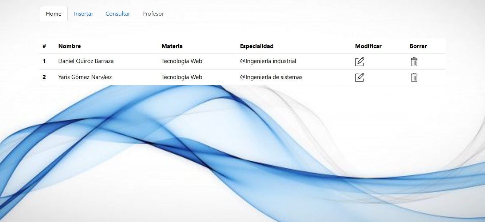
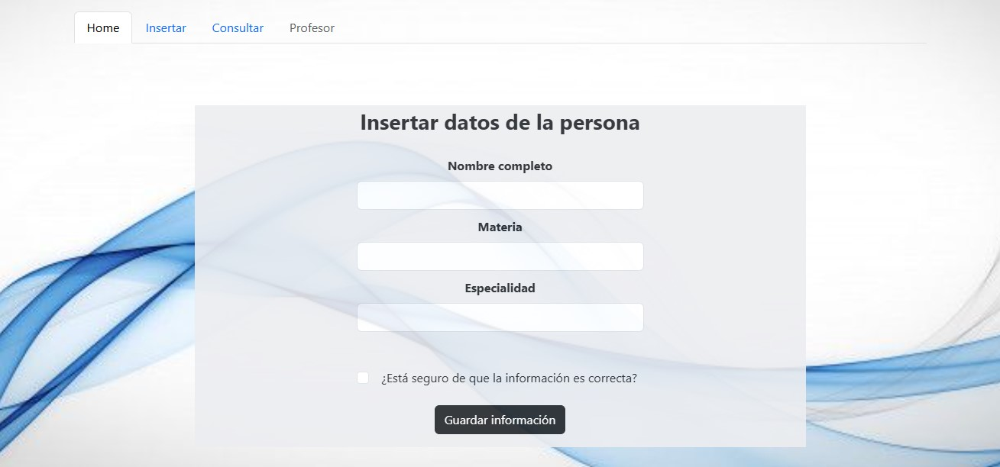
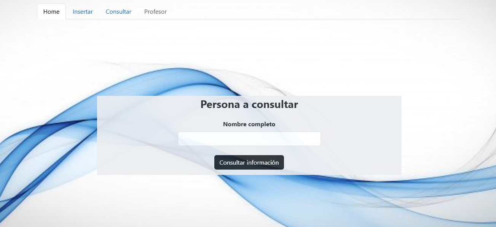

# php-profesorWeb

Proyecto universitario en PHP enfocado en la gestión de datos de profesores, implementando un sistema CRUD. Este proyecto permite registrar nuevos profesores, visualizar la información almacenada, actualizar los datos existentes y eliminar registros cuando sea necesario. Además, integra una base de datos MySQL para el manejo estructurado de la información y utiliza formularios para interactuar con el sistema. El objetivo principal es aprender y aplicar los fundamentos de PHP, consultas SQL, validación de datos y organización de un proyecto web sencillo orientado a la administración de información.

